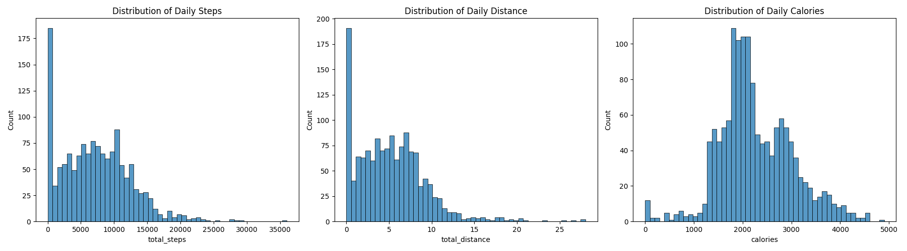
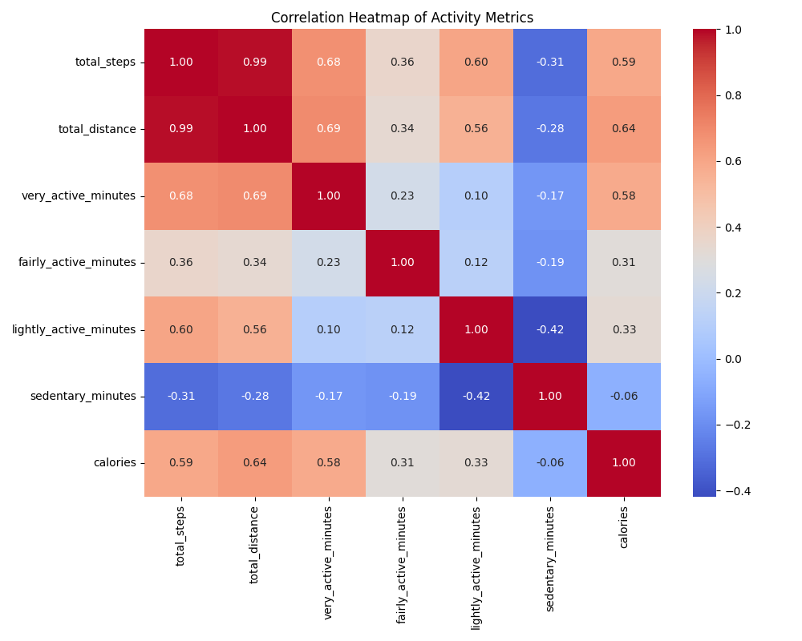

# Bellabeat Data Analysis Case Study

## Project Overview
In this case study, I assume the role of a junior data analyst at Bellabeat, a high-tech manufacturer of health-focused products for women. Although Bellabeat is a successful small company, they have the potential to become a larger player in the global smart device market. 

**Urška Sršen**, Bellabeat’s cofounder and Chief Creative Officer, believes that analyzing smart device fitness data could help unlock new growth opportunities. I have been tasked with analyzing smart device data to gain insight into how consumers are using their smart devices. These insights will help guide the company's marketing strategy.

## About Bellabeat
Bellabeat is a high-tech company that manufactures health-focused smart products for women. Founded in 2013, Bellabeat has grown rapidly and quickly positioned itself as a tech-driven wellness company for women.
*   **Mission:** Empower women with knowledge about their own health and habits.
*   **Key Products:** Bellabeat app, Leaf tracker, Time watch, Spring water bottle, and Bellabeat membership.

---

## Phase 1: Ask

### 1.1 Business Task
The primary objective of this project is to analyze smart device usage data from non-Bellabeat smart devices. The goal is to identify trends in consumer behavior and apply these insights to a specific Bellabeat product. Ultimately, these findings will inform high-level marketing recommendations to help Bellabeat unlock new growth opportunities.

### 1.2 Key Stakeholders
*   **Urška Sršen:** Bellabeat’s cofounder and Chief Creative Officer. Primary stakeholder interested in data-driven insights.
*   **Sando Mur:** Mathematician and Bellabeat’s cofounder; key member of the executive team.
*   **Bellabeat Marketing Analytics Team:** A team of data analysts responsible for guiding Bellabeat’s marketing strategy.

### 1.3 Guiding Questions
To guide my analysis, I am addressing the following key questions:
*   What is the problem I am trying to solve?
*   How can these insights drive business decisions?
*   What are some existing trends in smart device usage?
*   How could these trends apply to Bellabeat customers?
*   How could these trends help influence Bellabeat marketing strategy?

### 1.4 Key Tasks
1.  **Identify the business task:** Analyze non-Bellabeat smart device usage to improve Bellabeat's marketing strategy.
2.  **Consider key stakeholders:** Focus on the needs of Urška Sršen, Sando Mur, and the broader marketing team.

### 1.5 Deliverable
A clear statement of the business task: Analyze smart device usage data to identify trends in how consumers use non-Bellabeat smart devices, then apply these insights to a specific Bellabeat product to provide high-level recommendations for the company's marketing strategy.

---

## Phase 2: Prepare

### 2.1 Data Sources Used
For this analysis, I am using the **FitBit Fitness Tracker Data** (CC0: Public Domain), which is available on Kaggle via Mobius. This dataset contains personal fitness tracker data from thirty Fitbit users who consented to the submission of personal tracker data, including minute-level output for physical activity, heart rate, and sleep monitoring.

### 2.2 Guiding Questions & Answers

*   **Where is your data stored?**
    The data is stored locally in my project directory across two main folders: `mturkfitbit_export_3.12.16-4.11.16` and `mturkfitbit_export_4.12.16-5.12.16`.
*   **How is the data organized? Is it in long or wide format?**
    The data is organized in several CSV files. Most of the files (like `dailyActivity_merged.csv` and `heartrate_seconds_merged.csv`) are in **long format**, where each row represents a specific time point or day for an individual user ID.
*   **Are there issues with bias or credibility in this data? Does your data ROCCC?**
    *   **Reliable:** Low. The sample size is only 30 users, which is small for a representative population.
    *   **Original:** Low. This is a third-party dataset collected via Amazon Mechanical Turk.
    *   **Comprehensive:** Medium. It covers activity, sleep, and heart rate, but lacks demographic information like age or gender, which is critical for Bellabeat's female-focused strategy.
    *   **Current:** Low. The data is from 2016 (nearly 10 years old), so usage trends may have shifted significantly.
    *   **Cited:** High. The source is clearly identified and publicly available.
*   **How are you addressing licensing, privacy, security, and accessibility?**
    The dataset is CC0 (Public Domain), ensuring no licensing issues. All data is anonymized (User IDs only), maintaining privacy. I am working with the data in a secure local environment.
*   **How did you verify the data’s integrity?**
    I performed initial data profiling to check for consistent formatting, unique user counts (confirming 30+ users), and identifying any obvious outliers or missing values.
*   **How does it help you answer your question?**
    By analyzing daily steps, calories, and sleep patterns, I can identify common behavior "nudges" (e.g., when users are most active) that can be integrated into Bellabeat's app features.
*   **Are there any problems with the data?**
    Yes—the small sample size, age of the data, and lack of demographic context (specifically gender) are significant limitations. I will need to acknowledge these when presenting recommendations.

### 2.3 Key Tasks
1.  **Download and store data:** Completed. Files are organized in the project folder.
2.  **Identify organization:** Verified long format for primary activity files.
3.  **Determine credibility:** Identified limitations in sample size and currency (ROCCC analysis).

### 2.4 Deliverable
A description of all data sources used, including the specific datasets selected for analysis:

*   **dailyActivity_merged.csv:** Contains daily summary data for steps, distance, intensities (minutes and distance), and calories. This is the most comprehensive daily file.
*   **dailyCalories_merged.csv:** Focuses specifically on the total calories burned per day.
*   **dailyIntensities_merged.csv:** Breaks down daily activity into sedentary, lightly active, fairly active, and very active minutes/distances.
*   **sleepDay_merged.csv:** Provides daily records of sleep, including the number of sleep sessions, total minutes spent asleep, and total time spent in bed.
*   **weightLogInfo_merged.csv:** Tracks weight in kilograms and pounds, BMI, and whether the entry was a manual report.
*   **Source Summary:** The primary data source is the FitBit Fitness Tracker Data (2016), consisting of 18 CSV files detailing the daily habits of 30+ Fitbit users.

---

## Phase 3: Process

### 3.1 Tools & Environment
I utilized **Python** within **Jupyter Notebooks** for a reproducible and documented workflow.
*   **Data Processing:** `Pandas` for merging 12 raw CSV files and `NumPy` for numerical validation.
*   **Visual Analysis:** `Matplotlib` and `Seaborn` for identifying patterns and correlations.

### 3.2 Cleaning & Transformation Pipeline
I implemented a standardized pipeline to ensure data integrity:
1.  **Data Consolidation:** Merged datasets from two time periods to create a single source of truth for each metric (Activity, Sleep, Weight).
2.  **Naming Conventions:** Standardized all headers to `snake_case` (e.g., `TotalSteps` -> `total_steps`) for consistency.
3.  **Temporal Consistency:** Converted date strings into `datetime` objects, enabling time-series analysis.
4.  **Deduplication:** Verified and removed redundant records (e.g., handling duplicates in `sleepDay`).
5.  **Quality Check:** Identified that ~8.2% of total records contained zero steps, which I categorized as "non-wear days".

### 3.3 Visual Analysis & Interpretations

#### A. Distribution of Core Metrics

*   **Interpretation:** The **Total Steps** and **Distance** histograms show a right-skewed distribution with a significant peak at zero. This confirms "non-wear" days where the tracker was likely not used. **Calories** follows a near-normal distribution, indicating most users burn between 1,800 and 2,800 kcal daily.

#### B. Correlation Analysis

*   **Interpretation:** 
    *   **High Impact:** A near-perfect correlation (0.98) exists between **Total Steps** and **Total Distance**.
    *   **Calorie Burn:** **Very Active Minutes** and **Total Steps** show the strongest positive correlation with calories burned, highlighting these as key metrics for weight management features.
    *   **Sedentary Insight:** **Sedentary Minutes** has a weak negative correlation with calories, suggesting that simply reducing inactivity is a vital "nudge" for user health.

### 3.4 Process Validation (Guiding Questions)
*   **Tools Choice:** Python was chosen for its efficiency in merging millions of rows (especially heart rate data) and its superior visualization capabilities.
*   **Data Integrity:** Verified that unique user counts (33 users) remained consistent across merged activity files.
*   **Cleaning Documentation:** All steps—from header standardization to duplicate handling—are documented in the `EDA.ipynb` notebook.
*   **Verification:** Used `df.info()` and summary statistics to ensure structural integrity and absence of nulls in key analytical columns.

### 3.5 Phase 3 Deliverable
**Processed Data Summary:**
*   **Consolidation:** 12 raw CSVs merged into 6 master DataFrames.
*   **Formatting:** Applied `snake_case` headers and parsed all date-time strings.
*   **Validation:** 0 duplicates in `dailyActivity`; identified non-wear patterns (8.2% zeros).

